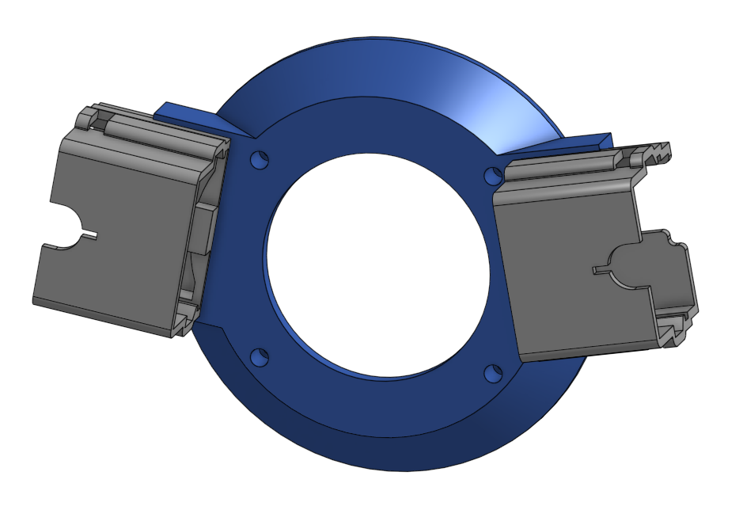

# Camaro Sim-Racing Interface

This project documents the conversion of a real-world Camaro steering wheel and column stalk assembly into a USB HID Game Controller for PC racing simulations.

The system uses two independent Arduino Pro Micros (ATmega32U4) to handle the high input count and separate the wiring harnesses for the steering wheel and the steering column.

<!-- 

 -->

---

## Hardware Pinout Identification & Reverse Engineering

To interface the steering wheel with a PC, I had to decode how the factory hardware communicates. I started by accessing the ChiltonLibrary at my local library to pull the original wiring diagrams and pinouts for all the required connectors. This is a great staring point to identify which pins to begin testing, but is not required.

Next is to identify what type of cuircuit is used for each button. There are three distinct types of circuits within the steering wheel assembly:

### 1. Simple Closed Circuit (Digital)
These are standard buttons where a press simply completes a circuit to ground.
* **Identification:** Set a multimeter to **Continuity Mode**.
* **Procedure:** Hold one probe to the ground pin and the other to a signal pin. Press the button; if the multimeter "beeps" or shows $0\Omega$, it is a simple switch.
* **Arduino Mapping:** These are connected to **Digital Pins** on the arduino, where each button gets a dedicated pin.

### 2. Resistive Ladders (Analog)
Automotive manufacturers often use a "resistive ladder" to send multiple button signals over a single wire to save space in the steering column.
* **Identification:** Continuity tests will fail here because the circuit always has some resistance.
* **Procedure:** Set the multimeter to **Resistance ($\Omega$) Mode**. Connect to the signal and ground pins. Press different buttons in the group; if each button gives a different, repeatable resistance value (e.g., $100\Omega$, $500\Omega$, $1k\Omega$), it is a resistive ladder.
* **Arduino Mapping:** These must be connected to **Analog Pins (ADC)**. The firmware then uses voltage ranges to determine which specific button was pressed.

### 3. Digital Signal (ASIC Bypass)
In some modules, buttons are processed by an onboard microchip (ASIC) that converts presses into a complex digital protocol (like LIN-Bus).
* **Identification:** If there is no continuity and no varying resistance, and a microchip is visible on the circuit path, the pin is outputting a digital data stream that is difficult for a standard microcontroller to decode.
* **The Solution:** To bypassed the microchip. This involved soldering directly to the **SMD components** or **contact pads** behind the buttons to grab the "raw" signal before going to the microchip.
* **Arduino Mapping:** These will most likely be Simple Closed Circuit, where each button gets a dedicated **Digital Pin**.

---

## Software & Libraries Used

To compile and flash the firmware, you will need the following software and external libraries:

* **Arduino IDE (v2.3.5 or higher):** [Download here](https://www.arduino.cc/en/software/)
* **Arduino Joystick Library (v2.1.1):** Created by Matthew Heironimus.  
This library allows the Arduino Micro to be recognized as a standard HID Game Controller. [View Repository](https://github.com/MHeironimus/ArduinoJoystickLibrary)

### How to Install the Joystick Library

Since this library is not available in the standard Arduino Library Manager, you must install it manually:

1. **Download the Library:** Go to the [GitHub Repository](https://github.com/MHeironimus/ArduinoJoystickLibrary) and click **Code > Download ZIP**.
2. **Install via IDE:**
   * Open the Arduino IDE.
   * Go to **Sketch** > **Include Library** > **Add .ZIP Library...**
   * Select the `.zip` file you just downloaded.
3. **Verify Installation:**
   * Go to **File** > **Examples** > **Joystick**. If you see example sketches listed, the library is installed correctly.

## How to rename "Arduino Micro" to a Custom Controller Name

By default, an Arduino Micro appears in the Windows "Game Controllers" menu as **"Arduino Micro."** To give each arduino a custom name, you need to modified the Arduino AVR boards configuration to assign a custom **Vendor ID (VID)**, **Product ID (PID)**, and **Product Name**.

### Why use a Custom VID and PID?
Windows identifies devices primarily by their VID/PID combination. Therefore, not changind these two values still tells windows that the same device is plugged in even if the Product Name was changed.

### How the IDs work

* **The Hierarchy:** Every hardware vendor (like Logitech, Sony, or Arduino) is assigned a unique **VID**. The vendor then assigns a specific **PID** to each of their products (e.g., a mouse or a keyboard).
* **The Naming Conflict:** If you change the product name string but keep the default Arduino VID/PID, Windows will often ignore the new name and continue to display "Arduino Micro" because it has already cached that name for those specific IDs.
* **Unique Identity:** By picking a custom VID/PID combination that hasn't been used by a commercial product, we "force" Windows to recognize the hardware as a brand-new, unique device. This ensures the custom name is correctly registered and displayed in the Game Controllers menu.

### Chosing a unique VID/PID
Looking at the official [USB Vendor ID List](USB_Vendor_IDs/), the VIDs range form 0 to 65535 (0x0000 to 0xFFFF) where most VIDs are between 0 and 12000. Pick a 

### Step-by-Step Guide to Renaming the Device
#### (needs to be done any time the code is upleaded to the Arduino)

1. **Locate the Hardware Configuration:**
   * Navigate to: `%localappdata%\Arduino15\packages\arduino\hardware\avr\`
   * Open the folder with the highest version number (e.g., `1.8.7`).
   * Open the file named `boards.txt`.

2. **Modify the Identity Values:**
   * **Custom VID:** Find the line `micro.build.vid=0x2341`.  
   Change `0x2341` to a custom hex ID (e.g., any value from `0x0000` to `0xFFFF` not on the official USB-IF list).
   * **Custom PID:** Find the line `micro.build.pid=0x8037`.  
   Change `0x8037` to a random hex value of your choice.
   * **Custom Name:** Find the line `micro.build.usb_product="Arduino Micro"`.  
   Change `"Arduino Micro"` to your desired name (e.g., `"Sim-Wheel Controller"`).
   * **Save** the file.

3. **Flash the Firmware:**
   * Restart the Arduino IDE to load the updated `boards.txt`.
   * **Verify and Upload** your code. Your device will now appear in Windows with the custom name.

4. **Revert Configuration:**
   * Once the upload is finished, go back to `boards.txt`.
   * **Revert all values** back to their original defaults.
   * **Save and close.** 
> **Note:** Reverting the file is important so that your Arduino IDE continues to recognize and flash standard Arduinos correctly in future projects. The steering wheel will keep its custom name until the next time you flash it.

### My USB Configuration Settings
| VID | PID | Product Name |
| :--- | :--- | :--- |
| `0x7EFC` | `0x5501` | Camaro Wheel |
| `0x7EFC` | `0x5502` | Camaro Stalks |

---

<!-- 
## 🛠 Hardware Architecture

### 1. Steering Wheel Module
* **Controller:** Arduino Pro Micro
* **Input Count:** 15 Buttons + 1 8-Way Hat Switch (POV)
* **Custom Interface:** ASIC Bypass. Soldered directly to 220Ω ESD protection resistors to bypass the proprietary LIN-Bus chip.
* **Resistive Ladders:** * **A0:** Paddle Shifters
    * **A1:** Cruise Control functions
* **Logic:** D-Pad buttons are processed into a single POV Hat Switch (0°–315°) for better menu navigation.

### 2. Column Stalk Module
* **Controller:** Arduino Pro Micro
* **Input Count:** 15 Buttons (Digital + Analog)
* **Wiper Logic:** * **Analog Ladder (A0):** 5 Intermittent settings + Low speed.
    * **Digital Input (D10):** High-speed wiper override.
* **Signals & Lights:** 8 digital inputs for Turn Signals, High Beams, and Washer.

---

## 📐 Wiring & Pinout

### Steering Wheel (Pro Micro #1)
| Pin | Function | Wiring Type |
| :--- | :--- | :--- |
| **A0** | Paddle Shifters | Analog (10kΩ Pull-up) |
| **A1** | Cruise Control | Analog (10kΩ Pull-up) |
| **2-5** | Audio Buttons | Digital (Input Pull-up) |
| **6-9** | D-Pad (Up, Down, Left, Right) | Digital (POV Hat) |
| **10, 14, 15** | Select / Phone Buttons | Digital (Input Pull-up) |
| **VCC** | Resistor Rail | 5V Output to 10kΩ Pull-ups |
| **GND** | Ground Rail | Common Ground for all switches |

### Column Stalks (Pro Micro #2)
| Pin | Function | Logic / Range |
| :--- | :--- | :--- |
| **A0** | Wiper Ladder | 10kΩ Pull-up (Infinite = OFF) |
| **15** | Wiper High | Digital (Priority Override) |
| **2,3** | Turn Signals | Digital (Input Pull-up) |
| **4-6** | Light Switch (Low, Park, Toggle) | Digital (Input Pull-up) |
| **7,8** | High Beam (In/Out) | Digital (Input Pull-up) |
| **14** | Windshield Washer | Digital (Input Pull-up) |

---

## 💻 Code Logic Highlights

### 1. Priority Wiper Control
To prevent conflicting signals, the code uses a priority gate. If the physical "High" switch is active, the analog "Low/Intermittent" signals are automatically ignored.

### 2. POV Hat Switch Map
The D-pad is mapped using diagonal logic to allow for 8-way movement:
- **Up + Right:** 45°
- **Down + Right:** 135°
- **Down + Left:** 225°
- **Up + Left:** 315°

### 3. Global Variable Management
State variables are initialized globally to ensure memory efficiency and allow for future implementation of "Long Press" or "Double Tap" features without re-initializing variables in the main loop.

---

## 🔧 Installation & Calibration

1.  **Dependencies:** Requires the [Arduino Joystick Library](https://github.com/MHeironimus/ArduinoJoystickLibrary).
2.  **ADC Calibration:** Use a Serial Debug script to find your specific resistive values. 
    * *Current Build Profile:* Uses a 10kΩ Pull-up resistor for all analog ladders.
3.  **Hardware Assembly:** * Use double-sided perf board for durability.
    * Socket the Pro Micro using female headers for easy replacement.
    * Leave a 1-hole gap between the Pro Micro and male pin headers to prevent solder bridges.

---

## ⚠️ Disclaimer
Interfacing with automotive PCBs requires bypassing proprietary ASIC chips. This project involves precision soldering to surface-mount components (SMD). Proceed with caution to avoid lifting pads or damaging the original hardware.
-->